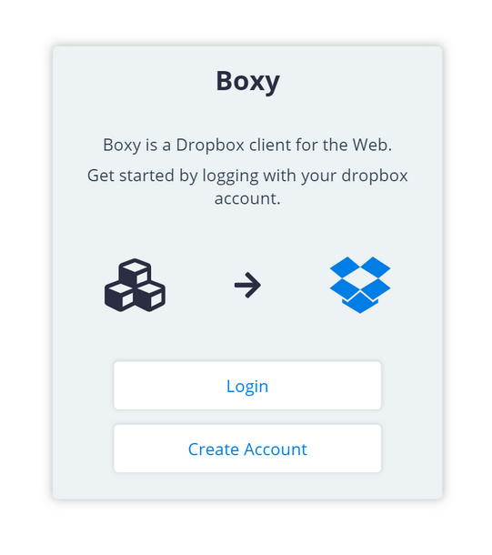
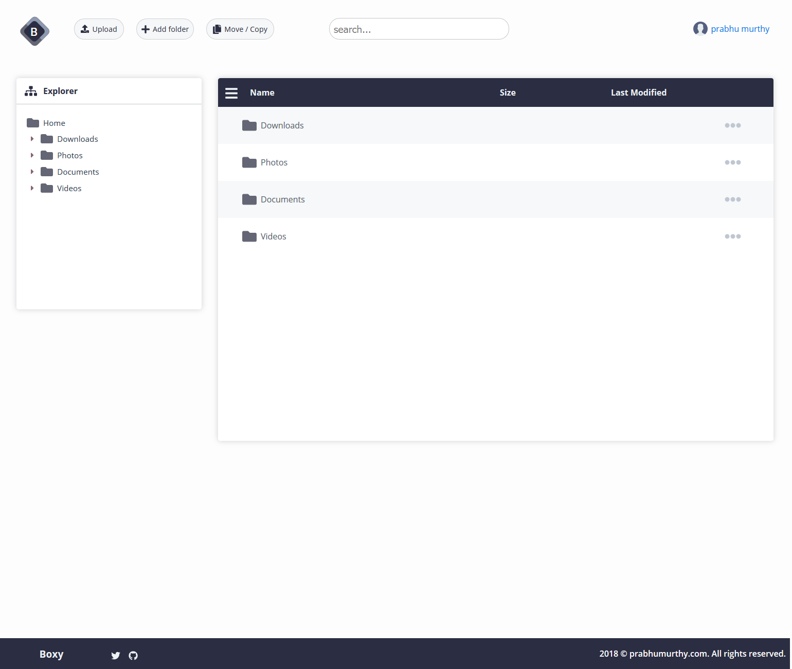

# Boxd

<!-- [![NPM Version][npm-image]][npm-url]-->
<!-- [![Downloads Stats][npm-downloads]][npm-url] -->
[](https://app.codacy.com/manual/prabhuignoto/boxd?utm_source=github.com&utm_medium=referral&utm_content=prabhuignoto/boxd&utm_campaign=Badge_Grade_Dashboard)
[](https://dev.azure.com/prabhummurthy/boxd/_build/latest?definitionId=2&branchName=master)
[](https://deepscan.io/dashboard#view=project&tid=10074&pid=12749&bid=201583)

Boxy is a modern web client for Dropbox. Boxy is built with Vue.js, and the goal was to create a simple and intuitive user interface to deliver high quality user experience.

_The application is still under active development._

<!--  -->


## Development setup

The client application is located under ui directory and the server app is located under server.

Execute the following command to run the front end app in Development mode.

```sh
cd .\ui
yarn run install && yarn run dev
```

Start the server app by running the following command.

```sh
cd .\server
yarn run install && yarn run serve
```

## Technology Stack

- [Vue.JS](vue)
- [Apollo Client (powered by vue-apollo)](apollo)
- [Express.JS](express)
- [Graphql (powered by express-graphql)](graphql)
- [Dropbox API for Node.JS](dropbox)
- [Redis for Session Management](redis)

## Release History

- 0.0.1
  - work in progress

## Meta

Prabhu Murthy – [@prabhumurthy2](https://twitter.com/prabhumurthy2) – prabhu.m.murthy@gmail.com

Distributed under the MIT license. See `LICENSE` for more information.

[https://github.com/prabhuingoto/](https://github.com/prabhuingoto/)

<!-- Markdown link & img dfn's -->

[npm-image]: https://img.shields.io/npm/v/datadog-metrics.svg?style=flat-square
[npm-url]: https://npmjs.org/package/datadog-metrics
[npm-downloads]: https://img.shields.io/npm/dm/datadog-metrics.svg?style=flat-square
[travis-image]: https://api.travis-ci.org/prabhuignoto/boxy.svg?branch=master
[travis-url]: https://travis-ci.org/dbader/node-datadog-metrics
[wiki]: https://github.com/yourname/yourproject/wiki
[vue]: https://vuejs.org
[graphql]: https://graphql.org
[apollo]: https://www.apollographql.com/
[redis]: https://redis.io/
[dropbox]: https://www.dropbox.com/developers/documentation/javascript
[express]: https://expressjs.com/
[logo]: ./boxy-logo.png
