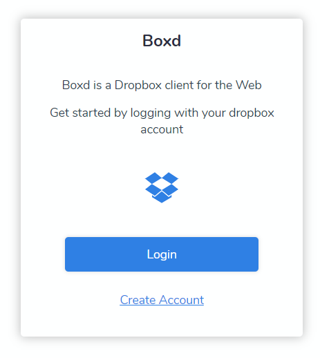

# Boxd

<!-- [![NPM Version][npm-image]][npm-url]-->
<!-- [![Downloads Stats][npm-downloads]][npm-url] -->
[](https://dev.azure.com/prabhummurthy/boxd/_build/latest?definitionId=2&branchName=master)
[](https://www.codacy.com/manual/prabhuignoto/boxd?utm_source=github.com&amp;utm_medium=referral&amp;utm_content=prabhuignoto/boxd&amp;utm_campaign=Badge_Grade)
[](https://deepscan.io/dashboard#view=project&tid=10074&pid=12749&bid=201583)
[](https://depfu.com/github/prabhuignoto/boxd?project_id=13611)

A Modern Web Client for Dropbox

<!--  -->


## Development Setup

### Server Prerequisites & Installation

Redis and MongoDB are mandatory prerequisites for the server to function. Please install [Redis](redis) and [MongoDB](mongo) before proceeding.

Please create a [Pusher](pusher) account and add the api details in the .env file (refer setting up the environment)

Once all the prerequisites are satisfied, simply start the server app by running the following command.

```sh
cd /server
yarn run install && yarn run dev
```

If everything setup correctly, you should see server running message

### Client Prerequisites & Installation

Please create a [Pusher](pusher) account and add the api details in the .env file (refer setting up the environment)

```sh
cd /ui
yarn run install && yarn run serve
```

## Preview


## Built with

- [Vue.JS](vue) - The frontend app is written in Vue with complete support for [Typescript](graphql).
- [Apollo Client](apollo) - The client uses vue-apollo to talk to the graphql server.
- [Fastify](fastify) - Server app is powered by [Fastify](fastify) and it hosts the Apollo-Server. It also manages File upload/download , Authentication & Authorization.
- [Graphql (powered by  apollo-server-fastify)](graphql) - Fastify internally uses apollo-server-fastify and exposes a GraphQLized endpoint for consumption.
- [Dropbox API for Node.JS](dropbox) - Dropbox SDK for NodeJS.
- [Redis for Session Management](redis) - Session Management is controlled by fastify-session. The sessions are stored in a dedicated Redis store.
- [Agenda](agenda) - The Server employs agenda for various polling mechanisms (for e.g batch check of dropbox operations).
- [MongoDB](agenda) - MongoDB is a prerequisite for Agenda (ref Agenda Docs for more information).

## What's new

- The UI now sports a new look and feel with a better user experience.
- The server and the frontend apps have been rewritten in Typescript.
- Migrated all the server side code from express to Fastify for better performance and simplicity.
- Frontend app is migrated to the latest version of Vue.
- Support for Pusher - Realtime notifications are now powered by Pusher.

## Meta

Prabhu Murthy – [@prabhumurthy2](https://twitter.com/prabhumurthy2) – prabhu.m.murthy@gmail.com

Distributed under the MIT license. See `LICENSE` for more information.

[https://github.com/prabhuingoto/](https://github.com/prabhuingoto/)

<!-- Markdown link & img dfn's -->

[vue]: https://vuejs.org
[graphql]: https://graphql.org
[apollo]: https://www.apollographql.com/
[redis]: https://redis.io/
[dropbox]: https://www.dropbox.com/developers/documentation/javascript
[fastify]: https://fastify.io/
[logo]: ./boxy-logo.png
[home]: ./boxy-mockup.png
[mongo]: https://www.mongodb.com/
[pusher]: https://pusher.com
